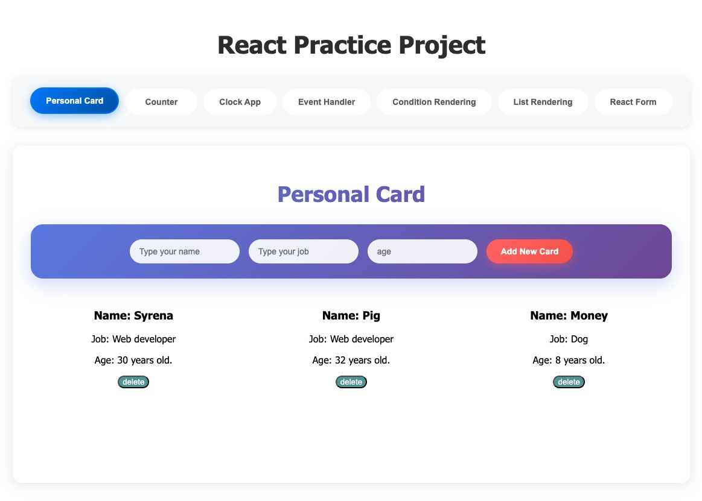

# My React Practice

> A collection of hands-on mini React projects to solidify my understanding of React fundamentals.

---

## Project Preview

-

## Practice Projects Collection:

- [01-personal-card](./src/components/PersonalCard/) - Props & JSX
- [02-counter-usestate](./src/components/Counter/) - useState Hook
- [03-clock-useeffect](./src/components/ClockApp/)- useEffect Hook
- [04-event-handling](./src/components/EventHandler/)- Event in React
- [05-conditional-rendering](./src/components/ConditionalRendering/)- Rendering Practice
- [06-list-rendering](./src/components/Listrendering/)-Rendering Practice
- [07-form-handling](./src/components/ReactForm/)- Form Practice

---

## What I Focus On

- Reusability of components
- Clear props structure and naming
- Proper hook usage (e.g., useState, useEffect)
- Clean, readable code
- Simple styling and layout
- Familiar with React hooks.

---

## Key Learnings

- State Management: Mastered useState for component state handling.
- Event Handling: Practiced various DOM events (onClick, onChange, onSubmit) and proper event binding.
- Component Lifecycle: Implemented useEffect for side effects like timers and data fetching.
- Conditional Rendering: Applied different techniques for showing/hiding components based on state.
- List Rendering: Used map() method for dynamic list creation with proper key handling.
- Form Handling: Built controlled components with validation and form submission logic.
